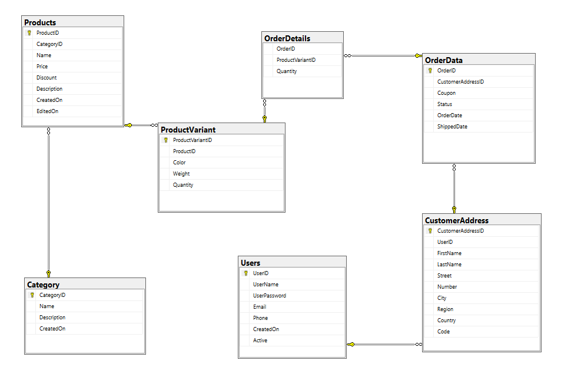

# MyOrdersDB
## Description 
This is a simple database which can be used for a shop, it can store users, customer addresses, products, product variants, categories, orders and more! 
## Diagram 
Below you can find the diagram representing the tables and relationships between them. 

## Tables 
### Categories 
Links:  
This is the table which stores categories. CategoryID is the primary key. We have a Name, Description and CreatedOn columns present. No foreign keys are needed on this one, however CategoryID is used on Product, as a foreign key. 
### Customer Addresses 
Customer adresses are stored in the CustomerAddress table. This is linked to a User and one particular user can have multiple addresses associated with it. In this table, we have the following columns: CustomerAddressID, UserID, FirstName, LastName, Street, Number, City, Region, Country, Code. CustomerAddressID is the primary key. As mentioned, UserID is a foreign key. 
### Order Data 
OrderData, as the name suggests, is responsible for overall data on a particular order. OrderID is the primary key, while CustomerAddressID is a foreign key on the CustomerAddress table. Besides that, we have the following columns: Coupon, Status, OrderDate, ShippedDate. 
### Order Details 
This table is responsible for bringing the OrderData and ProductVariant tables together. It has no primary, but it does have two foreign keys (OrderID and ProductVariantID) which are used for the purpose described earlier in the paragraph. We also have the Quantity column in here. 
### Products 
The Products table has the following columns: ProductID, CategoryID, Name, Price, Discount, Description, CreatedOn and EditedOn. ProductID is the primary key for this table and CategoryID is a foreign key (each product has a Category associated with it), as mentioned in the Categories section. 
### ProductVariant  
Product variants, such as color or weight are represented in this table. ProductVariantID is the primary key, while ProductID is the foreign key which points to a specific product. Each product can have multiple variations. The other columns are as follows: Color, Weight and Quantity. These are pretty self-explanatory. 
### Users 
Lastly, we have the Users table. This is where all the important data on users will be found, including UserName and UserPassword. The primary key for this table is UserID. There is no foreign key present on this table. Its key is linked to the CustomerAddress table using the UserID foreign key. As mentioned earlier, one particular user can have multiple addresses associated with it. Other columns are: Email, Phone, CreatedOn and Active. 
